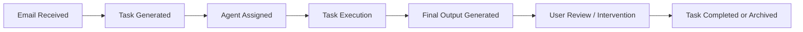

## Task Lifecycle

Every task in AssistCX moves through a defined lifecycle from the moment an email is received until the work is completed or resolved.

Understanding this lifecycle helps teams track task progress, identify issues, and take corrective action when needed.

---

#### 1. Email Intake

The lifecycle begins when an email is received from a connected mailbox.

AssistCX ingests the email and stores relevant information such as:

- Sender
- Subject
- Email body
- Attachments
- Timestamp

The email then appears in the **Task Inbox**.

---

#### 2. Task Generation

Once the email is ingested, the system generates one or more tasks associated with that email.

Each task contains structured information required for execution, including:

- Task title
- Description
- Attachments
- Tags
- Associated agent

A single email may produce multiple tasks depending on workflow configuration.

---

#### 3. Agent Assignment

After task creation, the task is assigned to an agent responsible for processing it.

The agent assignment determines:

- How the task will be processed
- Which tools may be used
- What instructions and rules apply
- What output structure is expected

The assigned agent appears in the **Task Overview** panel.

---

#### 4. Task Execution

The agent begins processing the task based on its configured logic.

During execution the agent may:

- Analyze task input
- Retrieve knowledge
- Invoke tools
- Apply validation rules
- Generate structured output

Execution activity is recorded in the **Execution Log**, allowing users to inspect how the task was processed.

---

#### 5. Output Generation

After execution completes, the system generates a **Final Output**.

This output typically includes:

- Task status
- Final answer
- Task summary

The output reflects the result produced by the assigned agent.

---

#### 6. Review and Intervention

Users can review the task outcome directly within the task workspace.

If necessary, users can take additional actions such as:

- Retrying task execution
- Updating task status
- Reporting issues
- Viewing execution details

These actions allow manual intervention when automated processing requires correction.

---

#### 7. Completion or Resolution

A task lifecycle concludes when the task reaches a final state.

Common final states include:

- **Completed** — task processed successfully
- **Failed** — execution encountered an error
- **Archived** — task closed and removed from active workflows

The final state remains visible in the Task Inbox for tracking and auditing purposes.

---

### Why the Task Lifecycle Matters

The defined lifecycle ensures that every task moves through a predictable execution flow.

This helps teams:

- Track operational progress
- Investigate execution issues
- Maintain visibility into agent behavior
- Ensure tasks are processed consistently