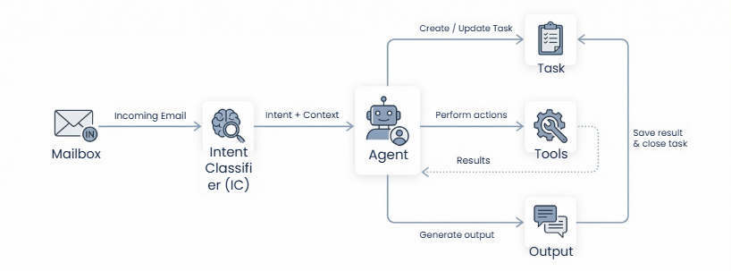
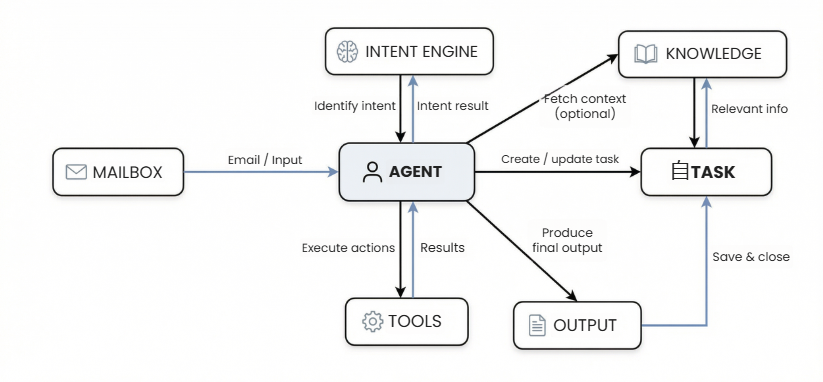

## Agent Architecture

The Agent architecture defines how incoming requests move through the platform and how tasks are executed.  
It separates classification, task management, execution, and output handling into clearly defined stages.

This structure ensures that task processing remains predictable, traceable, and scalable.  
Each stage in the pipeline has a specific responsibility, which prevents overlapping logic and makes the 
system easier to operate and extend.

At a high level, agents act as the execution layer within a broader processing pipeline.  
They do not determine what the request is they determine how the identified request should be handled.

---

#### Processing Pipeline

The architecture follows a staged processing pipeline:

**Mailbox → Intent Classification → Task Creation → Agent Execution → Tools → Output → Task Closure**

Each stage performs a specific role in processing incoming requests.  
Because responsibilities are clearly separated, the platform can evolve individual components without 
affecting the entire workflow.

---

#### Mailbox (Input Layer)

The process begins with the **Mailbox**, which captures incoming emails or messages.

At this stage, the platform only receives and stores the communication.  
No interpretation or execution logic is applied yet.

The mailbox acts as the entry point that feeds incoming requests into the processing pipeline.

---

#### Intent Classification

After ingestion, the message is passed to the **Intent Classifier**.

The classifier analyzes the content of the message to determine what the request represents.  
It identifies the intent of the request and extracts contextual signals that help determine how the task 
should be handled.

The result of this stage is structured intent information that guides the next step in the pipeline.

This layer performs classification only. It does not execute tasks.

---

#### Task Creation or Update

Once the intent has been identified, the platform creates or updates a **Task**.

The task becomes the central object used to manage execution.  
It stores the extracted context, the assigned agent, execution status, and any outputs generated during 
processing.

Because all execution activity is attached to a task, the system maintains full visibility into how the 
request was processed from start to finish.

---

#### Agent (Execution Layer)

The **Agent** is responsible for executing the task.

When the agent receives a task, it evaluates the available context, follows its configured instructions, 
and determines the actions required to complete the work.

During execution, the agent may retrieve information, apply decision logic, invoke tools, or generate 
responses.  
The agent operates within defined configurations so that task handling remains consistent and predictable.

---

#### Tools (Action Layer)

Agents use **Tools** to perform specific operational actions.

Tools allow the system to interact with external services, validate information, retrieve data, or perform 
structured transformations.

Instead of embedding these actions inside the agent logic, tools operate as reusable capabilities.  
This modular design allows multiple agents to use the same tools while keeping execution logic organized.

---

#### Output Generation

After completing the required actions, the agent generates a structured **Output**.

The output may include extracted data, a generated response, or instructions for the next step in the 
workflow.  
All outputs are attached to the task record, creating a clear execution history.

This ensures that decisions, results, and actions remain observable.

---

#### Task Closure

Once execution is complete, the task lifecycle is finalized.

The system updates the task status, saves the generated outputs, and records the execution results.  
Depending on the workflow, the task may be marked as complete or forwarded to another stage.

This final step ensures traceability across the entire processing lifecycle.

---

#### Architectural Characteristics

The platform architecture follows several key design principles.

**Separated Responsibilities**  
Each stage in the pipeline performs a specific role, preventing execution logic from mixing with 
classification or task management.

**Task-Centered Processing**  
Agents operate on structured tasks rather than raw messages, which ensures consistent execution across 
requests.

**Reusable Capabilities**  
Tools and integrations can be reused across multiple agents without duplicating configuration.

**Governed Execution**  
Agents operate within defined instructions and system rules, ensuring predictable task outcomes.

**Extensible Design**  
New intents, agents, or tools can be added without redesigning the overall architecture.