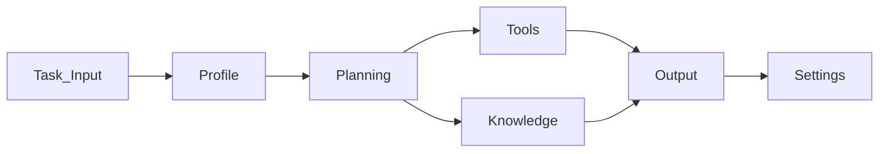

## Build Your First Agent

Creating an agent is the first step in defining how work is processed inside the platform.

An agent represents a digital worker responsible for handling a specific type of task. Once created, the 
agent can analyze incoming requests, use configured tools, reference knowledge sources, and generate 
structured outputs based on the instructions you define.

Agents allow teams to automate repeatable processes while maintaining control over execution rules and 
outcomes.

---

### Ways to Create an Agent

The platform provides three ways to create an agent. Each method supports a different setup approach 
depending on how much control or speed you need during configuration.

You can either design an agent manually, import an configuration, or generate a baseline agent 
using the guided builder.

---

#### Start from Scratch

Use **Start from Scratch** when you want full control over how the agent behaves.

This option allows you to configure every aspect of the agent, including its purpose, execution 
instructions, tools, and permissions. It is commonly used when organizations are designing a new workflow 
that requires precise behavior and governance.

##### Example

A **Customer Support Agent** is created to handle incoming support emails.

The agent is configured to:

- Identify the type of customer issue  
- Retrieve order details from an internal system  
- Generate a response draft for the support team  

Because the agent is built from scratch, the support team can define the exact instructions, response 
format, and escalation rules.

> **Note:** This approach is best suited for teams that need complete control over agent behavior.

---

#### Import Agent

Use **Import Agent** when you want to create or update an agent using a JSON configuration file.

In AssistCX, the JSON structure must align with the platform’s internal configuration, especially the **Data Template structure**.  
Because of this, not all external JSON files can be directly imported.

The recommended approach is:

- Export an existing agent from AssistCX to obtain a valid JSON structure  
- Use that exported file as a base template  
- Modify the configuration as needed  
- Re-upload the updated JSON to create or update an agent  

Alternatively, you can create a custom JSON file, but it must strictly follow the same structure and schema used within AssistCX.

After uploading, the platform reads the configuration and recreates the agent with the defined setup.  
You can then review and adjust details such as tools, permissions, instructions, or environment-specific settings before saving.

##### Example

A team wants to update an existing **Invoice Processing Agent**.

Instead of creating it from scratch:

- They export the current agent as a JSON file  
- Modify the instructions and output fields in the file  
- Re-import the updated JSON  

Since the file follows the correct AssistCX structure, the agent is created successfully with the updated configuration.

> **Note:** Import works reliably only when the JSON follows AssistCX’s internal schema. Exporting an agent first ensures compatibility and prevents structure-related issues.
---

#### Agent Builder

Use **Agent Builder** when you want a faster and guided way to create an agent.

Agent Builder asks for high-level information about the agent’s purpose and automatically generates a 
baseline configuration. You can then review and refine the generated instructions, tools, and permissions 
before deploying the agent.

This option is useful when teams want to quickly prototype an agent before refining its behavior.

##### Example

A **Meeting Summary Agent** is created using Agent Builder.

The user provides:

- The purpose of the agent: summarize meeting transcripts  
- The expected output: structured meeting notes  
- Required integrations: document storage and collaboration tools  

Based on this information, the system generates an initial agent configuration that extracts key 
discussion points, decisions, and action items from meeting transcripts.

The user can then refine the instructions or add additional tools before using the agent in production.

> **Note:** Agent Builder provides a faster starting point while still allowing detailed customization later.