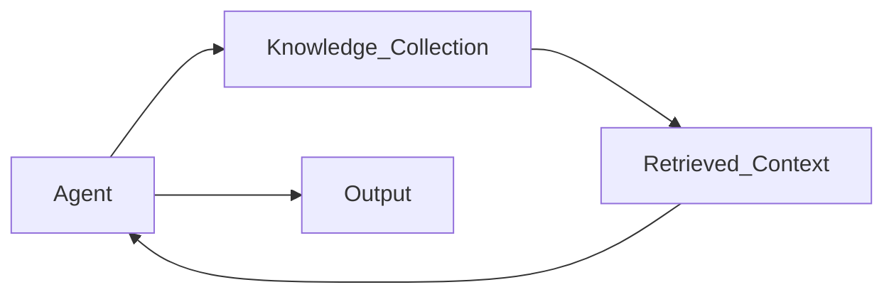

## Knowledge

The **Knowledge** section defines the reference information the agent can use while processing tasks.

Knowledge collections provide domain context, policies, or documentation that help the agent generate accurate and consistent outputs. When knowledge is attached, the agent can retrieve relevant information from these collections while executing a task.

If no knowledge collections are attached, the agent will rely only on the task input and its configured instructions.

---

### Overview

Knowledge collections act as a reference layer for the agent.

They typically contain internal documentation or structured information that the agent may need during task processing.

Common examples include:

- Standard operating procedures (SOPs)
- Internal policies
- Product documentation
- Knowledge base articles
- Frequently asked questions (FAQs)
- Operational guidelines

Attaching the right knowledge collections helps the agent generate responses that align with organizational policies and procedures.

---

### Assigning Knowledge Collections

When no knowledge collections are attached, the agent will display an empty state.

To configure knowledge, select one or more collections from your workspace.

#### Select Collections

Choose the knowledge collections that the agent should reference during task execution.

Each collection should be relevant to the agent’s responsibility and workflow.

For example, a support agent should only have access to support documentation rather than unrelated operational documents.

---

### Example

A **Customer Support Agent** handles incoming support emails.

To help the agent respond accurately, the team attaches the following knowledge collections:

- Product troubleshooting guides  
- Support response templates  
- Warranty and return policies  

When the agent receives a customer question, it retrieves relevant information from these collections and uses it to generate a response that aligns with official support documentation.

---

### How Knowledge Is Used

During task execution, the agent can retrieve relevant information from the attached knowledge collections.

A typical interaction looks like this:

1. The agent receives a task.
2. It analyzes the task input and identifies the information needed.
3. The agent retrieves relevant content from the attached knowledge collections.
4. The retrieved information helps the agent generate a more accurate response or decision.

Knowledge improves context and accuracy but does not override the agent’s configured instructions or rules.

---

### When to Add Knowledge

Attach knowledge collections when the agent needs reference material to perform its task.

This is common when workflows depend on policies, documentation, or operational guidelines.

**Examples**

- A **Support Agent** referencing troubleshooting documentation  
- A **Compliance Agent** referencing regulatory policies  
- A **HR Agent** referencing employee handbook guidelines  

Avoid attaching overly broad collections that contain unrelated information, as this may reduce retrieval accuracy.