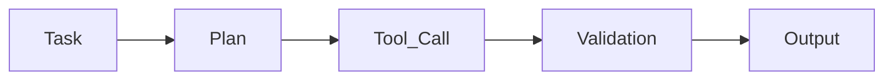

## Planning

The **Planning** section defines the steps the agent should follow when executing a task.

While the **Profile** describes the agent’s purpose and **Tools** provide the actions it can perform, Planning defines **the sequence of steps the agent uses to complete work**.

By defining a plan, you guide the agent through a structured workflow so tasks are processed consistently.

---

### Overview

A plan represents the execution workflow the agent follows when handling a task.

It breaks the work into ordered steps such as interpreting the task, retrieving data, invoking tools, validating results, and preparing the final output.

Planning helps ensure that the agent processes tasks in a predictable and controlled manner.

Typical steps in a plan may include:

- Interpreting the task input  
- Retrieving additional context  
- Calling tools to perform actions  
- Validating intermediate results  
- Preparing the final output

---

### Creating a Plan

When no plan is defined, the agent will display an empty state.

Select **+ New Planning** to create a new execution workflow.

While creating a plan, define:

- What the agent should do
- The order in which actions should occur
- When tools should be invoked
- What intermediate results should be validated

A well-defined plan helps the agent execute tasks reliably.

---

### Example

A **Support Ticket Resolution Agent** processes incoming support requests.

The planning workflow may look like this:

1. Analyze the incoming email to determine the issue type.
2. Retrieve customer account information using a **Customer Lookup Tool**.
3. Check the ticket history using a **Ticket History Tool**.
4. Determine the appropriate resolution based on the issue type.
5. Generate a response draft for the support team.

By defining these steps, the agent follows a structured workflow instead of making ad-hoc decisions.

---

### How Planning Works During Execution

When a task is assigned to the agent, the following execution flow occurs:

1. The agent receives the task input.
2. It references the defined planning workflow.
3. Each step is executed in the specified order.
4. Tools are invoked when required.
5. Results are evaluated before moving to the next step.
6. The final output is generated.

This structured approach ensures that tasks are handled consistently across executions.

---

### Dependencies

Planning works best when the agent has the required resources configured.

Before defining a plan, ensure that:

- Required **Tools** are attached
- Relevant **Knowledge collections** are available (if needed)
- The **Output structure** is defined

These dependencies allow the agent to execute each step successfully.

---

### When Structured Planning Is Useful

Planning is especially important when workflows require multiple actions or validations.

Common scenarios include:

- Document processing workflows
- Customer support automation
- Data extraction and validation tasks
- Compliance or approval workflows
- Multi-step integrations with external systems

For simple response-generation agents, minimal planning may be sufficient.