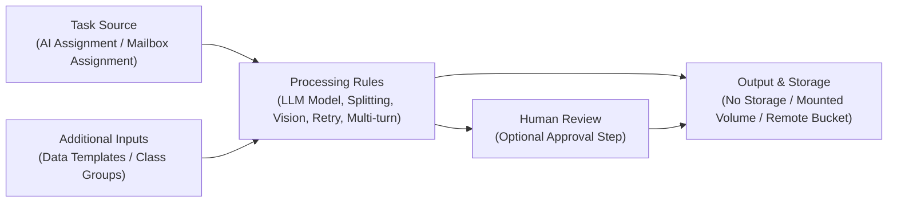

## Settings

The **Settings** section controls how the agent receives tasks, processes them, stores results, and applies operational rules.

While **Profile, Tools, Planning, and Output** define what the agent does, Settings define **how the agent operates within the platform environment**.

These configurations influence task routing, data handling, execution behavior, and optional human oversight.

---

### Task Source

The **Task Source** setting determines how tasks are assigned to this agent.

Two assignment methods are available.

#### AI Assignment

Tasks are automatically routed to the agent based on intent classification.

When the system identifies that an incoming request matches the agent’s configured purpose, the task is automatically assigned.

**Example**

A **Support Triage Agent** may automatically receive tasks when incoming emails are classified as *support requests*.

---

#### Mailbox Assignment

Tasks are created from emails received in a specific mailbox.

By assigning a mailbox to the agent, all incoming emails from that mailbox are converted into tasks handled by the agent.

**Example**

A **Finance Processing Agent** may receive tasks from an `invoices@company.com` mailbox.

---

### Additional Inputs

Additional inputs provide structured context that the agent can use during task execution.

#### Data Templates

Data templates define structured fields the agent can use when extracting or organizing information from task content.

**Example**

An **Invoice Extraction Agent** may use a data template with fields such as:

- Vendor Name  
- Invoice Number  
- Invoice Date  
- Total Amount  

Using templates ensures extracted data follows a consistent structure.

---

#### Class Groups

Class groups allow the agent to categorize or classify content during task execution.

These groups typically represent predefined categories or labels used in workflows.

**Example**

A **Customer Support Agent** may categorize tasks into:

- Billing Issues  
- Technical Problems  
- Account Requests  

This helps route tasks or trigger different workflow actions.

---

### Output & Storage

This section defines where the results generated by the agent are stored.

#### No Storage

Outputs generated by the agent are not persisted.

Use this option when results are temporary or do not need to be stored.

---

#### Mounted Volume

Stores outputs in a configured local or network storage location.

This option is useful when the organization manages storage infrastructure internally.

---

#### Remote Bucket

Stores outputs in external cloud storage such as an object storage bucket.

This option is commonly used for scalable storage or integration with external systems.

---

### Processing Rules

Processing rules control how the agent executes tasks and handles specific conditions.

---

#### Agent LLM Model

Selects the language model used for the agent’s reasoning and task processing.

The default model is recommended unless specialized capabilities or cost considerations require a different model.

---

#### Split Task by Attachments

When enabled, each attachment in an incoming email becomes a separate task.

**Example**

If an email contains **five invoices**, enabling this option creates **five independent tasks** so each invoice can be processed separately.

---

#### Split Task by Records

When a task contains multiple structured records, each record is processed as a separate task.

**Example**

If a document contains **multiple rows of transaction data**, each row can be processed independently.

This improves traceability and parallel processing.

---

#### Vision Data Extraction

Allows the agent to use vision capabilities to read information from images or scanned documents.

**Example**

An invoice sent as a **scanned PDF or image** can be analyzed and its data extracted.

---

#### Retry Incomplete Tasks

If a task fails or does not produce a result, the system will automatically retry the task once before marking it as failed.

This helps recover from temporary processing errors.

---

#### Multi-turn Task Execution

Allows users to send follow-up instructions to continue or refine a task after the initial execution.

This is useful when workflows require multiple interactions.

**Example**

A user may ask the agent to **revise extracted data or regenerate a response** without creating a new task.

---

### Human Review

The **Human Review** option allows a person to review certain agent actions before they are completed.

#### Enable Human Review

When enabled, the agent pauses before executing specific tool actions and sends the task for human approval.

This is useful for workflows that require oversight.

**Example**

A **Payment Processing Agent** may require human approval before triggering financial transactions.

### Publish the Agent

Once all configuration sections are complete, you can publish the agent to make it available for task processing.

The **Publish** button is located in the top-right corner of the agent editor.

Publishing the agent activates the configuration and allows the system to route tasks to the agent based on the defined settings.

Before publishing, ensure that:

- The agent **Profile** is properly defined
- Required **Tools** are attached
- **Planning** steps are configured
- **Output fields** are defined
- **Settings** such as task source and processing rules are correctly configured

After publishing, the agent becomes available to process tasks within the configured workflow.