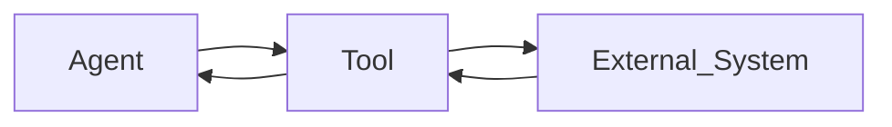

## Tools

The **Tools** section defines the actions an agent can perform while processing a task.

Tools allow the agent to interact with systems, retrieve information, update records, or trigger operational workflows. While the agent decides what needs to be done, tools perform the actual actions required to complete the task.

If no tools are attached, the agent can still analyze inputs and generate responses, but it will not be able to perform external system actions.

---

### Overview

Tools extend the agent’s capabilities by enabling it to interact with connected systems.

Depending on the workflow, tools can be used to retrieve data, update systems, or trigger operational processes.

**Common tool actions include:**

- Calling APIs  
- Sending or receiving emails  
- Retrieving records from databases  
- Updating CRM or ticketing systems  
- Processing files or documents  
- Triggering external workflows  

An agent can use one or multiple tools depending on the task requirements.

---

### Adding Tools

When no tools are attached, the agent will display an empty state.  
You can add tools using one of the following options.

---

### Create New Tool

Use **Create New Tool** when the required integration or action does not already exist.

This option allows you to configure a new tool within your workspace and define the action it performs.

Once created, the tool can be reused by other agents in the workspace.

**Example**

A team creates a **CRM Lookup Tool** that retrieves customer details from their CRM system using a customer ID.

After the tool is configured, any agent can use it to retrieve customer data during task processing.

---

### Select Existing Tools

Use **Select Tools** to attach tools that are already available in your workspace.

This option is useful when the required integrations are already configured and you want to reuse them across multiple agents.

Reusing existing tools helps maintain consistency and reduces configuration effort.

**Example**

A support workflow agent attaches an existing **Ticket Update Tool** that updates ticket status in the helpdesk system.

Instead of creating a new integration, the agent reuses the existing tool to update ticket progress during task handling.

---

### How Agents Use Tools

During task execution, the agent decides whether a tool needs to be used.

A typical interaction flow looks like this:

1. The agent receives the task and analyzes the input.
2. Based on its instructions, the agent determines that an external action is required.
3. The agent invokes the appropriate tool with the required input.
4. The tool performs the action and returns the result.
5. The agent continues processing the task using the returned information.

This process allows agents to combine reasoning with operational actions.

---

### Example

A **Support Resolution Agent** processes a customer email reporting a billing issue.

During execution:

1. The agent analyzes the email content.
2. It calls a **Customer Lookup Tool** to retrieve account details.
3. It calls a **Billing Status Tool** to verify payment status.
4. Based on the results, the agent generates a response and updates the support ticket.

By using tools, the agent can retrieve accurate information and complete the task without manual intervention.