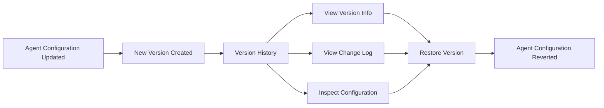

## Version History and Restore

The **Version History** panel records changes made to an agent configuration over time.

Each saved version represents a snapshot of the agent at a specific moment. This allows teams to review configuration changes, compare differences between versions, and restore a previous version if needed.

Version history helps maintain traceability and provides a safe way to revert configuration changes.

---

### Version Selector

At the top of the Version History panel, you can select a saved version of the agent.

Each version entry includes:

- Version identifier (for example, `v1`)
- Timestamp of when the version was created

Selecting a version loads the corresponding configuration details and change information.

---

### Version Info

The **Version Info** section displays metadata for the selected version.

This typically includes:

- **User** – The person who created the version
- **Created At** – Timestamp when the version was saved
- **Agent ID** – Unique identifier for the agent
- **Version ID** – Unique identifier for the version

This information provides traceability and accountability for configuration changes.

---

### Change Log

The **Change Log** highlights the differences between the selected version and the previous configuration.

Changes are grouped into three categories:

- **Added** – New configuration elements introduced in this version
- **Changed** – Existing elements that were modified
- **Removed** – Elements removed from the previous configuration

A summary at the top displays the total number of differences.

Each category can be expanded to view detailed changes, including configuration keys and their values.

This allows teams to quickly understand what changed before restoring a version.

---

### Configuration Viewer

The **Config Viewer** displays the complete configuration for the selected version.

This view allows you to inspect the full agent setup, including:

- Profile configuration
- Instructions and rules
- Planning steps
- Output structure
- Tools and knowledge references
- Agent settings

Reviewing the configuration helps verify that the version contains the expected behavior before restoring it.

---

### Restoring a Version

The **Restore this version** button reverts the agent to the selected configuration.

When a version is restored:

- The current configuration is replaced with the selected version
- All sections of the agent are updated accordingly
- The restored configuration becomes the active state

Restoration does not merge configurations. It completely replaces the current configuration with the selected version.

---

### Version Information

Each version records contextual metadata, including:

- The user who made the change  
- Timestamp of creation  
- Agent ID  
- Version ID  

This information provides accountability and traceability across configuration updates.

---

### Change Log

The Change Log highlights differences between versions in a structured format.

Changes are categorized into:

- **Changed** – Existing configuration elements that were modified  
- **Added** – New elements introduced in the version  
- **Removed** – Elements deleted from the previous configuration  

The system also provides a summary count of total differences, allowing quick assessment of configuration impact.

Each category can be expanded to inspect detailed modifications.

This structured comparison enables controlled review before accepting or reverting changes.

---

### Configuration Viewer

The Config Viewer allows inspection of the complete configuration for the selected version.

This provides transparency into:

- Behavioral instructions  
- Planning logic  
- Output schema  
- Tool and knowledge references  
- Operational settings  

Reviewing the full configuration ensures informed decision-making before restoring.

---

### Restoring a Previous Version

The **Restore this version** action reverts the agent to the selected historical configuration.

Restoring replaces the current configuration state with the chosen version. This affects:

- Instructions and rules  
- Planning structure  
- Output definitions  
- Settings and execution logic  

Restoration does not merge configurations. It fully replaces the active configuration with the selected version.

After restoration, the reverted version becomes the active configuration moving forward.

---

### Operational Considerations

Version History acts as a controlled rollback mechanism during iterative updates.

Restoring a previous version should be done carefully, especially if:

- The agent is already deployed in production  
- Downstream systems depend on specific output schemas  
- Recent changes were made to tool integrations or settings  

Review the Change Log and Config Viewer before restoring to avoid unintended execution behavior.

Version History ensures safe experimentation while preserving configuration integrity.