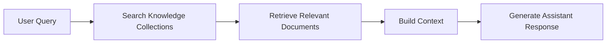

## Knowledge Sources

The Assistant can reference organizational knowledge stored within AssistCX to provide more accurate and context-aware responses. This knowledge typically comes from documents and datasets organized within knowledge collections.

When a user submits a query, the Assistant analyzes the request and retrieves relevant information from available knowledge sources. The retrieved information is then used as context for generating the final response.

By using knowledge stored within the platform, the Assistant can provide answers that reflect organizational documentation, policies, and operational information.

---

### Knowledge Collections

Knowledge collections act as structured repositories where documents and other information sources are organized. These collections allow teams to store important documentation that can later be referenced by the Assistant.

Documents added to collections may include internal policies, product documentation, training materials, standard operating procedures, or other reference materials used within the organization.

Organizing information into collections helps ensure that knowledge remains structured and accessible when the Assistant retrieves information during conversations.

---

### Documents and Knowledge Assets

Within each collection, knowledge is stored in the form of documents or datasets. These documents represent the actual source material that the Assistant can analyze when responding to user queries.

When documents are added to a collection, their contents become searchable and can be referenced by the Assistant when relevant questions are asked.

This allows the Assistant to provide responses that are informed by the content of the documents stored within the platform.

---

### How the Assistant Retrieves Knowledge

When a user asks a question, the Assistant evaluates the query and identifies relevant information within available knowledge collections.

The system searches through stored documents to locate sections that match the intent of the user's request. These retrieved pieces of information are then combined with the user query to form the context used to generate the final response.

Because responses are generated using retrieved knowledge, the Assistant is able to provide answers that are grounded in the organization's existing documentation.

#### Retrieval Flow

The Assistant retrieves relevant information from knowledge collections before generating a response. The following flow illustrates how the system processes a query and builds the context required for answering it.

---

### Context Building for Responses

After retrieving relevant information from knowledge sources, the Assistant assembles the retrieved content together with the user's query. This combined context is then used to generate a response that reflects the available information.

By grounding responses in retrieved knowledge, the Assistant helps ensure that answers remain aligned with documented information rather than relying solely on general AI reasoning.

This approach allows users to obtain explanations, summaries, or insights that are based on the knowledge stored within AssistCX.