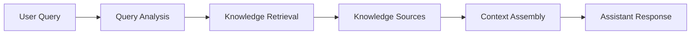

## Assistant Interface

The Assistant interface provides a conversational workspace where users can interact with AssistCX through query-based inputs. Instead of navigating across multiple sections of the platform, users can submit queries, explore knowledge, and retrieve information directly from the chat interface.

The interface is designed to keep interactions simple and focused. Users can enter queries, attach files, enable knowledge retrieval, and receive structured responses within a single workspace. If enabled, users can also extend retrieval to external sources using web search.

---

### Landing Page Overview

When the Assistant page opens, users are presented with the main chat workspace where all interactions take place.

The interface includes a conversation area where responses are displayed and an input field where users can submit queries or instructions. Messages appear in sequence, allowing users to follow the interaction flow and maintain context across multiple queries.

This layout enables continuous interaction with the Assistant without requiring navigation to other sections of the platform.

---

### Chat Interface Layout

The chat interface includes several elements that support interaction with the Assistant.

The **message input field** allows users to enter queries or instructions. Once submitted, the Assistant processes the request and generates a response in the conversation area.

The **send button** submits the query and initiates processing.

Users may also attach files or reference available knowledge sources as part of their query. If web search is enabled, the Assistant can also retrieve relevant external information to enhance the response.

All messages and responses are displayed in chronological order, allowing users to easily track the interaction.

---

### Assistant Processing Flow

When a user submits a query, the Assistant processes the request through multiple stages to generate a relevant response.

The system analyzes the query, retrieves relevant information from available sources (internal knowledge or external sources if enabled), assembles the required context, and generates a response that is displayed in the conversation window.

This ensures that responses are based on available data and configured sources.

---

### Guidelines

The interface may include a guidelines section that helps users understand how to interact effectively with the Assistant.

These guidelines typically provide examples of the types of questions the Assistant can answer and suggestions on how to structure queries to obtain clearer responses.

This guidance helps users understand the capabilities of the Assistant and improves the overall interaction experience, especially for first-time users.

---

### Chat Experience

The interaction flow within the Assistant follows a simple conversational pattern.

A user submits a question or request through the chat input field. The Assistant then analyzes the query, retrieves relevant context from available sources such as knowledge collections, uploaded files, or previous conversations, and generates a response.

The generated response appears in the conversation window, allowing users to review the answer and continue the conversation if needed.

This conversational approach enables users to explore information iteratively by asking follow-up questions and refining their requests.

---

### Response Behavior

Responses generated by the Assistant may include structured explanations, summaries, or references to relevant information retrieved from available sources.

The Assistant presents responses in a clear and readable format so users can quickly understand the information being returned. In some cases, responses may also reference knowledge sources or supporting content used during generation.

This behavior helps users better understand the context behind the generated output and increases trust in the responses provided.

---

### Follow-up Questions and Context Handling

The Assistant maintains conversational context across multiple messages within the same interaction. This allows users to ask follow-up questions without repeating all the details of their original request.

By referencing earlier parts of the conversation, the Assistant can generate responses that remain relevant to the ongoing discussion.

This contextual awareness creates a more natural conversational experience and helps users progressively refine their queries as they explore information.