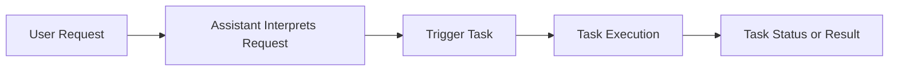

## Tasks

Tasks represent structured pieces of work that can be created, monitored, and executed within AssistCX. While the Assistant primarily focuses on answering questions and providing insights, it can also interact with tasks when users need to perform operational actions or trigger automated workflows.

Through the Assistant interface, users can request actions that result in task creation or task-related updates. This allows conversational interactions to move beyond information retrieval and support operational processes.

By connecting conversations with tasks, AssistCX enables users to transition from asking questions to initiating work without leaving the Assistant interface.

---

### What Tasks Mean in the Assistant

Within the context of the Assistant, tasks represent actionable work items that can be initiated or referenced during a conversation.

For example, a user may ask the Assistant to initiate a process, review a task status, or retrieve information related to an existing task. The Assistant interprets the request and interacts with the underlying task system to provide the required response.

This capability allows users to interact with operational workflows through natural language.

#### Task Interaction Flow

The following flow illustrates how the Assistant interprets a user's request and interacts with the task system to initiate or retrieve operational work.

---

### Running Tasks Manually

In some situations, users may request the Assistant to trigger a task manually. This typically occurs when a user wants to start a specific process or execute a predefined workflow.

The Assistant interprets the request, identifies the relevant task configuration, and initiates the task within the system. Once the task begins execution, users can monitor its progress through the platform’s task management features.

Manual task execution is useful when users want to initiate actions directly from the Assistant interface.

---

### Scheduled Tasks

Certain tasks may be configured to run on a scheduled basis. Scheduled tasks execute automatically according to predefined timing rules or triggers.

When the Assistant interacts with scheduled tasks, it may provide updates about when tasks will run, confirm that a task has been scheduled, or retrieve the results of previously scheduled executions.

This allows users to track automated processes through conversational queries.

---

### Task Status

Users can ask the Assistant about the status of tasks currently running in the system. The Assistant can retrieve task information and present updates related to progress, completion, or errors.

Providing task status through the Assistant helps users quickly understand the state of operational processes without navigating through multiple sections of the platform.

---

### Task Notifications

When tasks complete or encounter issues, notifications may be generated within the platform. The Assistant can help surface these updates by informing users about task outcomes when relevant.

This ensures that users remain aware of important task-related events while interacting with the Assistant.