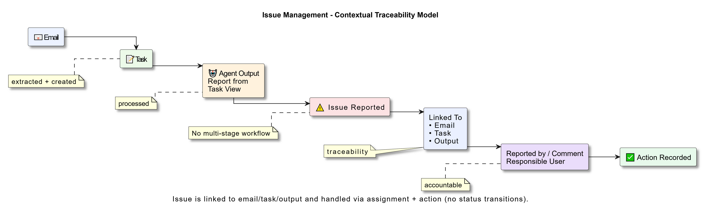

## Report an Issue

Reporting an issue allows users to flag problems directly from the workflow so they can be investigated and resolved.  
Issues should be raised whenever the system output looks incorrect, task execution fails, required information is missing, or agent behavior does not match expectations.

By reporting issues within AssistCX, the problem remains linked to the exact task or email where it occurred. This allows teams to investigate the issue using the complete execution context instead of relying on external explanations.

Issues raised through the platform become part of the Issue Management system and remain visible until they are resolved.

---

### Report from Task View

The most common way to report an issue is from **Task View**.  
From this view, users can inspect task outputs, execution logs, and attachments before raising an issue.

Reporting an issue from Task View ensures the system automatically captures the full task context, making troubleshooting significantly easier.

### Raise an Issue from Task Details

To report an issue from a task:

1. Open the task in **Task View**  
2. Review the output, logs, and execution results  
3. Select **Report Issue** from the task actions menu  
4. Enter the issue details in the issue form  
5. Submit the issue

Once submitted, the issue is recorded in the Issue Management module and becomes visible in the **Active Issues** list.

---

### Automatic Context Linking

When an issue is reported from Task View, AssistCX automatically links the issue to the relevant operational context.

The system records:

- Task ID  
- Associated email  
- Assigned agent  
- Execution logs  
- Generated output  
- Timestamps and task status  

Because this information is captured automatically, teams do not need to manually describe the environment where the issue occurred. This makes investigation faster and reduces the risk of missing critical details.

---

### Issue Form Fields

The issue form collects structured information about the problem being reported.  
Providing clear information helps teams diagnose the problem more efficiently and prioritize fixes appropriately.

#### Issue Title

A short summary describing the problem.

Example:  
**Incorrect invoice amount extracted**

---

#### Description

A detailed explanation of the issue.

This section should describe what was expected, what actually happened, and any observations that may help investigators reproduce the problem.

---

### Related Task or Email

When the issue is raised from Task View, the related task and email references are automatically populated.  
This ensures the issue remains directly connected to the workflow instance that produced the problem.

---

