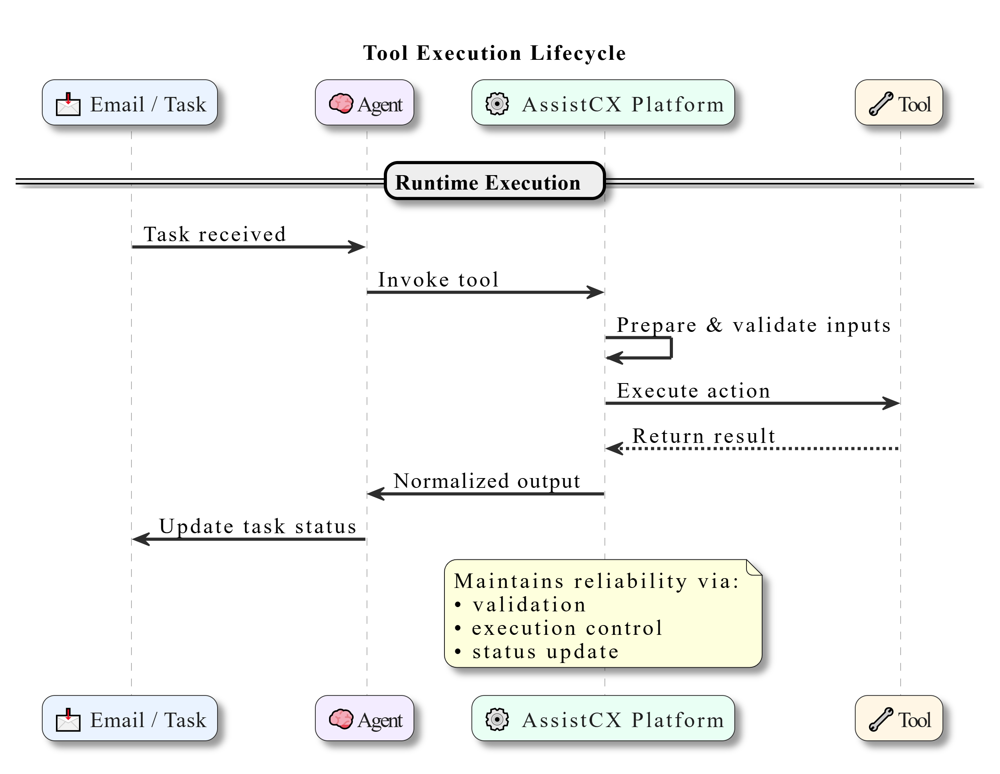

## Tools Overview

### What Are Tools?

Tools represent the execution layer of AssistCX.

While **Agents** interpret tasks and determine what needs to be done, **Tools perform the operational actions required to complete the work**. Tools enable the platform to interact with internal services, external applications, and connected systems.

For example, if a customer requests an address update, the agent identifies the request and gathers the required information. A Tool can then update the customer record in the CRM and log the change for audit purposes.

In document processing workflows, a Tool may validate extracted data and push the results into an ERP system.

Without Tools, agents would be limited to interpreting requests and generating responses.  
With Tools, AssistCX can execute real operational tasks.

---

### Why Tools Matter

Many business workflows require execution beyond analysis. Tools allow AssistCX to perform real system actions such as retrieving data, updating records, validating inputs, or triggering external processes.

This ensures that automation produces outcomes that are system-integrated, traceable, and reliable.

By connecting reasoning with execution, Tools enable AssistCX to automate operational work rather than simply interpret requests.

---

### Reusability and Consistency

Tools are designed to be reusable across multiple agents and workflows.

Instead of creating the same integration repeatedly, a single Tool can be attached to multiple agents. This reduces duplication and ensures consistent behavior across operational processes.

When a Tool is updated or improved, the changes automatically apply to all agents using that Tool, simplifying maintenance and improving reliability across the platform.

---

## Tool Execution Lifecycle

Every Tool operates within a structured lifecycle that governs how it is configured, invoked, and monitored during task execution.

### Registration and Configuration

Before a Tool can be used, it must be registered within the platform. During configuration, its expected inputs, output structure, authentication method, and execution parameters are defined.

This preparation ensures that the Tool can be safely invoked during runtime.

---

### Agent Mapping

When configuring an agent, only authorized and compatible Tools are made available.

This mapping ensures that each agent operates within defined capability boundaries and can only perform actions that are explicitly permitted.

---

### Runtime Invocation

During task processing, the agent evaluates the task context and determines whether a Tool needs to be invoked.

Before execution begins, the system verifies that required inputs are available and that the Tool is authorized for use.

---

### Input Validation and Execution

Before the Tool runs, input data is validated to ensure accuracy and completeness.

Once validated, the Tool performs its action. This may involve calling an external API, triggering an internal service, or interacting with a connected system.

Execution safeguards such as credential management and retry policies are automatically enforced.

---

### Response Handling and Persistence

After execution, the Tool response is captured and attached to the task.

Execution results, timestamps, and status updates are recorded to maintain traceability. The agent then determines the next step in the workflow, such as generating output or escalating the task.

All Tool activity remains auditable as part of the task lifecycle.

---

